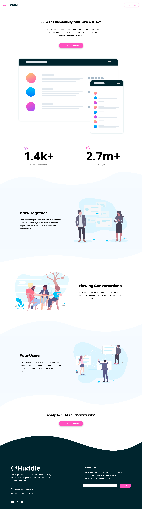

# Frontend Mentor - Huddle landing page with curved sections solution

This is a solution to the [Huddle landing page with curved sections challenge on Frontend Mentor](https://www.frontendmentor.io/challenges/huddle-landing-page-with-curved-sections-5ca5ecd01e82137ec91a50f2). Frontend Mentor challenges help you improve your coding skills by building realistic projects.

## Table of contents

- [Overview](#overview)
  - [The challenge](#the-challenge)
  - [Screenshot](#screenshots)
  - [Links](#links)
- [My process](#my-process)
  - [Built with](#built-with)
  - [What I learned](#what-i-learned)
  - [Continued development](#continued-development)
- [Author](#author)

## Overview

### The challenge

Users should be able to:

- View the optimal layout for the site depending on their device's screen size
- See hover states for all interactive elements on the page

### Screenshots

### Links

- Solution URL: [Add solution URL here](https://your-solution-url.com)
- Live Site URL: (https://huddle-lp-tch.netlify.app/)

## My process

### Built with

- Semantic HTML5 markup
- CSS custom properties
- Flexbox
- CSS Grid
- Mobile-first workflow

### What I learned

This is the first project I developed using the mobile-first approach. The site was built using only responsive units and dimensions (with the exception of border-radius, borders, an img margin fix and shadows). Media queries were created to assure the most optimal viewing experience for the user of any device. If this project's aim wasn't to be very simplistic, I see a lot of potential to adjust it even further for larger screens as some sections and elements become huge in higher resolutions.

### Continued development

I'm getting more and more comfortable using Grid and Flexbox. I plan on diving deeper with both techniques, especially to develop a natural feel of when to use which and how I can optimize my code to be as compact and efficient as possible. I know I still have to learn how to group properties and use utility classes.

## Author

- Frontend Mentor - [@zomasz](https://www.frontendmentor.io/profile/zomasz)
- Netlify - [t.chmielewski](https://app.netlify.com/teams/tchmielewski)
